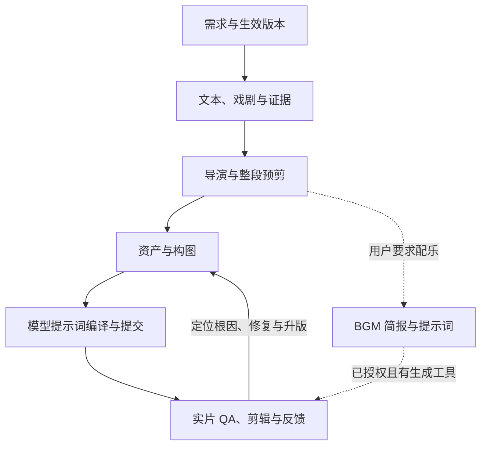

# Adapt Books to Video · 书籍改编与 AI 视频工作流

把书籍、章节、剧本或作品名转成可拍摄、可生成、可剪接的中文视频制作方案。

这是一套可安装的 **Agent Skill**：智能体读取 `SKILL.md`，按当前制作阶段加载相应参考文档，完成文本研究、剧本开发、导演设计、资产规划、分镜、视频提示词编译和成片验收。仓库只提供通用工作流与辅助脚本，不附带作品案例、原文全文、角色素材、图片、音频或视频。

## 目录

- [适用场景与能力](#适用场景与能力)
- [快速安装](#快速安装)
- [调用方式](#调用方式)
- [导演风格参数与工作流](#导演风格参数与工作流)
- [六阶段制作流程](#六阶段制作流程)
- [交付结构与版本管理](#交付结构与版本管理)
- [辅助脚本](#辅助脚本)
- [模型、工具与运行边界](#模型工具与运行边界)
- [参考文档导航](#参考文档导航)
- [验证与开发](#验证与开发)
- [常见问题](#常见问题)
- [许可证与来源](#许可证与来源)

## 适用场景与能力

| 任务 | 工作流提供的内容 |
| --- | --- |
| 书籍、章节和故事改编 | 版本定位、事件与人物清单、改编范围、人物目标、阻力、选择、代价与结果 |
| 短片、长片与分集短剧 | 篇幅路由、开场承诺、节拍、可拍性检查、集级承诺与兑现 |
| 纪录片方案 | 证据组织、paper edit、档案与采访规划、AI 重建边界 |
| 导演和预剪设计 | 场次调度、摄影语言、粗镜头表、声音结构、整段预剪时码 |
| 角色与场景一致性 | 身份与表演分离、空间锁、顶视验证、九机位卡、首帧锚点 |
| 模型提示词 | 审计记录、实际引用职责、冻结事实、动作时序、声音、终态与提交版编译 |
| 视频和剪辑 QA | 全时段动作、身份/道具/空间漂移、可用区间、实际终态和跨片段承接 |
| 按需配乐 | BGM 简报、提示词、生成条件、听审与剪辑登记 |

默认正式图片和最终视频为 **16:9**，单次视频生成任务 **不超过 15 秒**。总影片可以由多任务剪辑而成；15 秒是工作流的单任务上限，不是每镜必须达到的长度，也不是所有模型共同的产品限制。用户当前明确要求优先于默认设置。

## 快速安装

### 方式一：在 Codex 中让安装器从 GitHub 安装

将下面的文字直接发送给 Codex：

```text
使用 $skill-installer 安装这个 GitHub skill：
https://github.com/winLee1118/adapt-books-to-video/tree/main/adapt-books-to-video
```

仓库中的 `adapt-books-to-video/` 才是技能目录，安装时需要整目录包含 `SKILL.md`、`references/`、`scripts/` 和 `agents/`。安装器使用的落盘位置可能随其版本变化；以下手动安装方式使用当前 Codex 官方文档的 `.agents/skills` 发现路径。

### 方式二：跨平台本地安装

需要 Git 和 Python 3.10+。Windows、macOS、Linux 使用相同命令：

```bash
git clone https://github.com/winLee1118/adapt-books-to-video.git
cd adapt-books-to-video
python install.py
```

默认安装到当前用户的 `~/.agents/skills/adapt-books-to-video/`，适合在多个项目中使用。在 Windows 中，`~` 是当前用户主目录；如果系统的 Python 命令为 `python3` 或 `py -3`，请替换命令前缀。

只为指定项目安装：

```bash
python install.py --project /path/to/your/project
```

此命令将技能放到该项目的 `.agents/skills/adapt-books-to-video/`。在该项目中启动 Codex 即可发现。

仅预览安装目标和文件数：

```bash
python install.py --dry-run
```

安装脚本离线复制技能，不下载依赖、不修改智能体全局设置、不覆盖已有技能。如果目标已存在，请先把旧版本移到备份位置，然后重新安装，避免混合两个版本的参考文档。Codex 会发现新技能；若选择器没有刷新，可重新启动 Codex。参见 [Codex 官方 Skills 文档](https://developers.openai.com/codex/skills/)。

### 方式三：其他支持 Agent Skills 的智能体

技能采用带 `name`、`description` YAML 前置元数据的 `SKILL.md` 入口，所有引用使用相对路径，辅助脚本仅依赖 Python 标准库。

对于有专用技能目录的宿主，按照其文档确定目录，再运行：

```bash
python install.py --dest /path/to/agent/skills
```

`--dest` 是**技能父目录**，脚本会在下面创建 `adapt-books-to-video/`。例如，需要安装到 Claude Code 用户技能目录时可使用 `--dest ~/.claude/skills`；具体发现和调用行为以宿主当前文档为准。

对于没有自动发现功能的智能体，可以把完整技能目录放入工作区，并明确要求它读取 `adapt-books-to-video/SKILL.md`。只有能访问本地文件并遵循技能指令的宿主，才能完整执行这套流程。其他宿主的自动加载、工具权限和媒体能力需要分别验证。

## 调用方式

在 Codex 中显式调用：

```text
使用 $adapt-books-to-video。
把我提供的章节改编成 90 秒中文短片，采用真人写实风格。
先交付需求简报、证据清单、剧本、导演设计和预剪时码；
本轮只做文本方案，不生成图片、视频或音乐。
输出到我指定的制作目录。
```

继续已有项目：

```text
使用 $adapt-books-to-video 继续这个制作项目。
先读取 active-release.json 和 00-brief.md，沿用已选版本与风格，
检查当前生成任务的参考资产、提交提示词和前后镜承接。
```

只编译提示词：

```text
使用 $adapt-books-to-video，根据已批准的剧本和资产编译视频提示词。
目标为我指定的 Seedance 版本与实际平台入口。
核验该入口的当前能力后，交付上传清单、引用职责、审计版和可复制提交版。
本轮不提交生成任务。
```

输入最好包含作品文本或可核验来源、版本/译本、改编范围、受众、总片长、风格、声画要求、目标模型和交付目录。只有作品名时，智能体应先定位可访问的文本与版本，并说明未获取的内容；不能声称已经通读未取得的原文。

## 导演风格参数与工作流

导演风格是贯穿导演设计、资产、分镜、提示词和 QA 的可配置工作流。完整规范见 [导演与经典电影方法覆盖层](adapt-books-to-video/references/director-style-overlays.md)。可以提供导演、影片、流派作为分析参考，也可以直接给出摄影与叙事参数。

### 输入参数

| CLI 参数 | 默认值 / 可选值 | 工作流用途 |
| --- | --- | --- |
| `--style-reference` | 默认 `none`；接受导演、影片、流派名称或方法描述 | 写入 `project-config.json` 的 `director_or_classic_film_reference`，作为风格分析输入 |
| `--style-mode` | 默认 `observable-traits`；另可选 `named-reference-analysis-only` | 写入 `style_compilation_mode`，确定参考名称在分析与生成提示词之间的处理方式 |
| `--genre` | 默认 `auto`；接受用户给定的类型标签 | 写入 `genre`，辅助类型与节奏设计；不得压过已选主风格 |

`observable-traits`：把用户给定的方法描述或参考转成可观察的风格参数，作为实际制作约束。`named-reference-analysis-only`：在分析档案保留导演/影片名称，明确名称仅用于分析，再将方法拆成去专名参数。两种模式的模型提交版都应自包含，不能只靠导演名或电影名控制输出。

初始化脚本只登记上述输入，不会自动研究导演、生成风格合同或修改素材；后续由智能体读取配置并执行覆盖层工作流。已有项目可直接在任务中提出新参数，由智能体记录变更和影响范围，无须重新初始化项目。

在仓库根目录指定风格并预览配置：

```bash
python adapt-books-to-video/scripts/init_project.py --book "作品名称" --output ./work --production-track NARRATIVE --production-form AI_SHORT_DRAMA --format-route SHORT_FILM --style-reference "低机位静态观察、门框纵深、日常环境声、克制省略" --style-mode observable-traits --genre "家庭剧情" --dry-run
```

去掉 `--dry-run` 才创建项目。需要以导演或影片为分析索引时，将 `--style-reference` 替换为所选名称，并设置 `--style-mode named-reference-analysis-only`。

也可以直接向智能体提供参数：

```text
使用 $adapt-books-to-video。
导演风格参考：小津式低机位观察，仅研究高层方法。
风格模式：named-reference-analysis-only。
主摄影方法：接近坐姿视线的静态低机位、门框纵深与日常物件空镜。
声音：环境声为主；表演：通过可见行动和省略表现关系。
先在 04-style-bible.md 建立完整 STYLE-PROFILE 参数合同，
再用于 20-director-design.md、分镜和模型提示词；本轮只做文本方案。
```

### 风格合同字段

以下字段记录在 `04-style-bible.md`，是智能体需要展开的制作合同，**不是额外的 CLI 选项或模型 API 字段**。

| 字段 | 要记录的参数 |
| --- | --- |
| `style_profile_id` | 稳定风格 ID，例如 `STYLE-PROFILE-01` |
| `analysis_reference` | 分析参考及边界；名称不代替制作参数 |
| `narrative_bias` | 叙事倾向、观众信息量与揭示策略 |
| `lens_set_mm` | 焦段范围；落实到镜头的景别、机位和空间关系 |
| `shot_size_bias` | 远景、中景、近景等景别偏好 |
| `composition` | 前中后景、框中框、对称、人物比例和第一落点 |
| `camera_moves_allowed` / `camera_moves_avoid` | 运镜选择、可见触发、路径、停止条件与避免项 |
| `motion_budget` | 人物动作与摄影机运动的负荷分配 |
| `lighting` | 光源、方向、硬软、光比 |
| `palette` | 主色、辅色、强调色及适用边界 |
| `texture` | 颗粒、高光、黑位、材质响应 |
| `editing_rhythm` | 镜头长度倾向、停顿、切点与转场；不强制单任务固定时长 |
| `sound_policy` | 环境、拟音、音乐、静默；不自动授权音乐生成 |
| `performance_register` | 表演强度、身体规则与接收/回应方式 |
| `aspect_rewrite_16_9` | 将所选方法落实为 16:9 横幅构图 |
| `negative_additions` | 风格专属排除项与易混淆特征 |

### 方法索引与执行顺序

内置参考页提供以下方法索引，供选择与拆解，不是强制风格菜单：

- 导演方法：希区柯克、库布里克、黑泽明、小津、伯格曼、费里尼、塔可夫斯基、塞尔乔·莱昂内、王家卫、张艺谋、斯皮尔伯格、芬奇、维伦纽瓦、侯孝贤。
- 电影流派：黑色电影、德国表现主义、意大利新现实主义、法国新浪潮。
- 自定义方法：直接指定可观察的摄影、色彩、声音、剪辑与表演参数，由智能体建立原创组合。

执行链为：**读取配置/当前要求 → 选定主风格 → 方法分析 → STYLE-PROFILE 合同 → 导演设计 → 分镜与资产 → 去专名提交提示词 → 实片风格 QA**。

每个项目启用一个主覆盖层；多个参考不平均混合，最多从第二个参考借一个明确维度。未指定风格时使用 `DEFAULT-GROUNDED-DRAMA`。冲突顺序为：`历史/文本/证据硬约束 > 用户明确要求 > 主风格 > 类型片默认 > 默认写实基线 > 通用摄影默认`。

风格交付包括参考边界、完整参数合同、去专名中文提示词块、横幅构图、冲突处理、同一控制场景的无覆盖/覆盖差异与风格排除项。参数须贯通 `04-style-bible.md`、`20-director-design.md`、镜头表、锚点、提示词和 QA；风格变化影响的资产或任务需升版登记，已提交任务的旧文件保持可追溯。

## 六阶段制作流程



### 1. 需求与生效版本

先读取项目需求和生效清单，锁定版本/译本、改编范围、制作轨道、视觉风格、总片长、声音要求和交付范围。分别记录叙事/纪录轨道、媒介形式和总篇幅，避免把镜头长度误当影片长度。新项目可通过初始化脚本创建；旧项目按实际清单继续，不按文件名最高版本号猜测当前资产。

### 2. 文本、戏剧与证据

通读选定文本，建立人物、事件、世界元素和来源定位。把文学叙述转成可见行动和戏剧因果，检查开场承诺、人物目标、冲突、选择和结果。纪录片先组织证据与 paper edit，区分档案、采访、观察和 AI 重建。

每项可见主张分别标为 `TEXT`（文本）、`HISTORY`（历史）、`ICONOGRAPHY`（图像传统）、`INFERENCE`（推断）或 `CREATIVE`（创作）。人物具体面貌可作为透明的 `CASTING_CHOICE`，不从身份、族群或宗教名称推导。关键证据缺失时保持 `HOLD`，先推进不依赖这些资产的文字规划。

### 3. 导演与整段预剪

先锁整段导演设计、粗镜头表、声音结构和预剪时码，再大量精制资产。检查信息增量、行动因果、钩子兑现、停顿、镜头长度和切点。可使用临时图或占位做预演；没有渲染工具时交付时码表并标 `TIMING_REVIEW_ONLY`。

电影镜头、模型生成任务和最终剪辑片段分别登记。是否使用原生多镜头，以准确模型版本和实际入口支持情况为准；只有依赖前片真实终态的任务才等待前片验收。

### 4. 资产与构图

主要角色提供资料卡与表情卡；复用场景先完成生产设计、文字空间锁和无字顶视验证，再制作九机位场景卡。角色身份锁与剧情光线/表演状态分开管理。每个生成任务准备首帧锚点和六格故事板，必要时按已验证的能力选择结构参考模式。

选定序列的三张 `21:9` PREVIS 图用于提取文字导演决定，正式资产仍为 `16:9`。内部顶视 QA 图与 PREVIS 不上传最终视频模型；故事板默认为 QA，只有明确选择并核验结构参考模式时才准备可上传版本。裁切输入保留父图、范围、职责、版本和哈希。

### 5. 模型提示词编译与提交

先建立可追溯的完整审计记录，再编译自包含的提交版。提交版明确实际引用的资产、每份参考职责、视觉硬约束、动作时序、摄影机运动、声音和终态。完整性依据必要约束的覆盖情况判断，不以小节数量或字数判断。

Seedance 路线额外产出编译记录、上传清单和可复制提示词。每次核验准确模型版本、实际 UI/API、引用槽和原生/后期边界；未核验能力标 `NOT DOCUMENTED`。实际生成和上传仍需要可用工具及相应授权。

### 6. 成片、剪辑与反馈

审查候选视频的全时段动作、实际镜头数、身份/空间/道具漂移、可用区间和真实终态。核对前段末一秒、后段首一秒及真实剪接预览，通过后更新生效清单与剪辑时码。静态故事板和结构检查不能代替视频 QA。

失败时先找一个主要根因，再修资产、调度、动作负荷、参考冲突或剪辑方案；记录同条件试片结果。同一失败重复三次后更换可解释方案。配乐仅按需进入流程，生成后的音乐须实际听审再登记。

## 交付结构与版本管理

初始化会建立以下制作项目结构；这些文件由使用者运行后产生，仓库不附带生成项目：

```text
<作品名>-video-kit/
├── 00-brief.md … 25-video-result-qa.md
├── 21-shotlist-9col.csv
├── project-config.json
├── active-release.json
├── asset-manifest.csv
├── delivery/
│   ├── characters/       角色资料卡与表情卡
│   ├── scenes/           正式场景卡
│   ├── shot-anchors/     正式镜头锚点
│   ├── storyboards/      故事板
│   ├── style-cards/      风格卡
│   └── audio/            已验收的实际音频
├── process/
│   ├── cinema-triptychs/ 内部构图预演
│   └── model-inputs/     登记过的模型输入裁切
└── reports/
    ├── internal-qa/      顶视等内部检查
    ├── video-qa/         实片检查
    └── retries/          修复记录
```

| 文档范围 | 主要内容 |
| --- | --- |
| `00`–`03` | 需求、文本地图、研究资料、改编方案 |
| `04`–`06` | 风格、角色和场景设定 |
| `07`–`10` | 分镜、视频提示词、模型能力和来源 |
| `11`–`13` | 质量、连续性、声音与剪辑 |
| `14`–`18` | 正式剧本、参考资产映射、真实感、分集设定和剧本 QA |
| `19`–`22` | 摄影转场、导演设计、九栏镜头表和构图预演 |
| `23`–`25` | Seedance 编译、预剪审查和实片 QA |

详细字段见 [交付规范](adapt-books-to-video/references/output-spec.md)。初始化文件是待填写骨架，不代表内容已开发或审核。

`active-release.json` 固定当前使用的资产、任务、剪辑片段和桥接关系。资产状态分别管理：

| 维度 | 状态 | 含义 |
| --- | --- | --- |
| `evidence_status` | `PASS / HOLD / CONFLICT` | 可见主张的依据是否成立 |
| `generation_status` | `PLANNED / PROMPT_ONLY / GENERATED` | 文件是否实际生成 |
| `qa_status` | `PENDING / PASS / FAIL` | 视觉或音频审查是否通过 |
| `use_status` | `ACTIVE / SUPERSEDED / BLOCKED` | 当前是否使用 |

证据通过不表示素材存在；素材存在不表示已验收；已验收也不表示它是当前生效版本。没有生成能力时可完成 `PROMPT_ONLY` 规划。

## 辅助脚本

所有脚本只依赖 Python 标准库，不需要 API Key。

### 初始化制作项目

在仓库根目录运行：

```bash
python adapt-books-to-video/scripts/init_project.py --book "作品名称" --output ./work --production-track NARRATIVE --production-form AI_SHORT_DRAMA --format-route SHORT_FILM
```

此命令创建 `work/<作品名>-video-kit/`。默认生成时长按节拍决定，不预填固定 15 秒。脚本拒绝覆盖已有同名项目。

| 参数 | 用途 |
| --- | --- |
| `--book` | 必填，作品名，用于生成项目目录名 |
| `--output` | 必填，制作项目的父目录 |
| `--duration` | 可选，规划中的单任务时长，最大 15 秒 |
| `--panels` | 故事板格数，至少 6，默认 6 |
| `--production-track` | `NARRATIVE`、`DOCUMENTARY` 或 `BOTH` |
| `--production-form` | `FEATURE`、`DOCUMENTARY`、`AI_SHORT_DRAMA`、`MOTION_COMIC` 或 `HYBRID` |
| `--format-route` | `CONCEPT_SHORT`、`SHORT_FILM`、`FEATURE` 或 `SERIES` |
| `--production-type` | 未选、纪录、故事片或真人中式神话故事片 |
| `--target-model` | 记录目标模型，不自动验证模型能力 |
| `--style-reference` | 记录方法/电影/导演参考，仅用于分析 |
| `--style-mode` | `observable-traits`（默认）或 `named-reference-analysis-only`，见导演风格工作流 |
| `--genre` | 类型与节奏标签，默认 `auto`，服从主风格与文本约束 |
| `--episodes` | 可选，分集数量 |
| `--dry-run` | 输出计划与配置，不创建项目 |

省略制作轨道/形式/篇幅参数时，脚本预设为 `BOTH / FEATURE / FEATURE`；实际工作时应传入已经确认的选择。完整参数通过 `--help` 查看。

安装后可将命令中的技能路径替换为实际安装目录。智能体调用脚本时应使用技能目录下的脚本，并将输出写入制作项目，避免写入技能包。

### 检查生效清单

```bash
python adapt-books-to-video/scripts/validate_release.py "work/作品名称-video-kit/active-release.json"
```

验证器检查清单结构、引用文件与哈希、状态、任务时码、依赖、剪辑区间和桥接记录。输出为 JSON：

- `SCAFFOLD_ONLY`：没有生成任务的项目骨架，不能据此宣称制作完成。
- `STRUCTURE_OK`：结构校验通过；仍需真实素材、视听质量与剪接审查。
- `INVALID`：发现结构问题，退出码为 1。

`visual_quality_verified` 始终为 `false`，因为结构验证器不批准画面质量。

## 模型、工具与运行边界

| 能力 | 必要条件 | 缺失时的交付 |
| --- | --- | --- |
| 文本与制作规划 | 能访问文件并理解技能指令的智能体 | 需求、剧本、计划和待制作提示词 |
| 来源核验 | 用户提供可靠原始资料，或可用检索/浏览工具 | 明确证据空缺与 `HOLD` |
| 图片生成 | 宿主接入图片生成工具，并获得授权 | 资产提示词与 `PROMPT_ONLY` 台账 |
| 视频生成 | 真实可用的平台/连接器/CLI，已核验版本与授权 | 自包含提交提示词和上传清单 |
| BGM 生成 | 用户明确要求生成音乐，且有生成工具 | 音乐简报与待发送提示词 |
| 实片 QA 和导出 | 真实素材、播放/抽帧/音频检查及剪辑工具 | 检查计划与尚未验证状态 |

本技能不附带模型调用服务、账户、额度、密钥或专有插件。Seedance、即梦及其他模型按适配文档执行能力核验；接入哪一种工具由宿主决定。仅安装技能不会获得生成能力，也不会自动触发付费任务。描述性提示词默认使用中文，模型名、字段、资产 ID 与来源原文保留必要字面内容。

## 参考文档导航

入口是 [SKILL.md](adapt-books-to-video/SKILL.md)，按阶段读取，避免一次加载所有参考页。

| 主题 | 文档 |
| --- | --- |
| 调度、交付和预剪 | [执行合同](adapt-books-to-video/references/production-execution.md)、[交付规范](adapt-books-to-video/references/output-spec.md)、[片段组织](adapt-books-to-video/references/clip-sequencing.md) |
| 文本与证据 | [研究完整性](adapt-books-to-video/references/research-and-integrity.md)、[世界清单](adapt-books-to-video/references/text-world-inventory.md)、[证据门禁](adapt-books-to-video/references/asset-evidence-gate.md)、[身份与场景证据](adapt-books-to-video/references/identity-and-setting-evidence.md)、[视觉证据](adapt-books-to-video/references/visual-evidence.md) |
| 剧本与开场 | [剧本工作流](adapt-books-to-video/references/screenplay-workflow.md)、[戏剧与短剧](adapt-books-to-video/references/dramatic-engine-and-short-drama.md)、[开场承诺](adapt-books-to-video/references/opening-promise-design.md)、[编剧导演覆盖层](adapt-books-to-video/references/screenwriting-directing-overlay.md) |
| 导演与表演 | [导演设计](adapt-books-to-video/references/directing-and-dramaturgy.md)、[镜头桥接](adapt-books-to-video/references/cinematic-shot-bridging.md)、[演员表演](adapt-books-to-video/references/actor-performance-workflow.md)、[表演与微表情](adapt-books-to-video/references/performance-and-microexpressions.md) |
| 资产与空间 | [资产策略](adapt-books-to-video/references/reference-asset-strategy.md)、[资产台账](adapt-books-to-video/references/reference-asset-ledger.md)、[空间锁](adapt-books-to-video/references/scene-spatial-lock.md)、[场景生产设计](adapt-books-to-video/references/cinematic-scene-production-design.md) |
| 真实感与风格 | [真实感蒸馏](adapt-books-to-video/references/realism-distillation.md)、[角色真实感](adapt-books-to-video/references/character-realism-distillation.md)、[默认写实基线](adapt-books-to-video/references/default-grounded-drama-baseline.md)、[导演风格方法](adapt-books-to-video/references/director-style-overlays.md)、[构图预演](adapt-books-to-video/references/cinema-composition-overlay.md)、[神话电影](adapt-books-to-video/references/production-type-and-mythic-film.md) |
| 模型提示词 | [提示词规范](adapt-books-to-video/references/prompt-spec.md)、[模型适配](adapt-books-to-video/references/model-adapters.md)、[Seedance 编译](adapt-books-to-video/references/seedance-2x-workflow.md)、[结构故事板参考](adapt-books-to-video/references/structural-storyboard-reference.md) |
| 配乐与验收 | [背景音乐](adapt-books-to-video/references/background-music-workflow.md)、[实片 QA](adapt-books-to-video/references/video-result-qa.md)、[连续性与修复](adapt-books-to-video/references/continuity-and-failure-repair.md) |
| 方法来源 | [来源与署名](adapt-books-to-video/references/source-provenance.md) |

## 验证与开发

```bash
python -m unittest discover -s adapt-books-to-video/scripts -p "test_*.py" -v
python -m unittest discover -s tests -v
```

测试覆盖初始化不覆盖旧项目、制作配置、清单与状态/依赖校验，以及安装到独立目录和拒绝覆盖。测试使用临时目录，不生成媒体、不调用模型服务。GitHub Actions 在 Windows 与 Linux 的 Python 3.10 和 3.13 环境运行同样的检查。

修改工作流时保持引用为相对路径、保留来源边界，并让安装入口与文档匹配。可以通过 GitHub Issue 或 Pull Request 提交改进；复现资料请使用脱敏文本和最小状态说明，不需要上传作品素材。

## 常见问题

**安装之后会直接生成影片吗？**

不会。技能告诉智能体如何组织制作。是否能生成媒体取决于宿主的工具、平台权限和用户当前授权；没有生成工具时仍可交付完整文字方案。

**需要 Python 才能阅读技能吗？**

不需要。Python 用于安装、初始化和验证辅助脚本；纯文本工作流可由智能体直接读取。手工复制完整目录也可以安装。

**支持竖屏吗？**

现有脚本与正式资产规范使用 16:9。用户明确要求竖屏时，智能体应先协调工作流、资产规范和验证规则，再开展生产，不能声称现有验证器已支持 9:16。

**为什么有顶视图、九机位卡和 PREVIS？**

顶视图检查空间拓扑，九机位卡保持跨镜空间一致，PREVIS 提取构图与导演决定。它们的职责不同，内部验证图并不自动成为模型输入。

**模型能否保证遵守所有提示词？**

提示词是生产意图。模型输出仍需实际 QA；未经核验的产品能力和未播放的结果不能标为通过。

**可以拿来改编任何作品吗？**

工作流可以用于组织改编，但本仓库的许可不授予书籍、翻译、影视作品、人物肖像、音源或第三方素材的使用权。项目使用者应确认其输入和产出的相应授权。

## 许可证与来源

工作流文档及 YAML 元数据采用 **CC BY 4.0**；Python 代码采用 **MIT**。范围说明见 [LICENSE](LICENSE)，代码许可证全文见 [LICENSES/MIT.txt](LICENSES/MIT.txt)。

本技能整合的高层方法及历史来源记录保留在 [source-provenance.md](adapt-books-to-video/references/source-provenance.md)。其中 `smixs/visual-skills` 的相关方法署名为 **Serge Shima**，原方法按 CC BY 4.0 提供；其他外部仓库仅作为方法研究来源，未随此仓库分发其原始代码、模板、提示词或素材。参见 [NOTICE](NOTICE)。

开源包保留通用方法、字段协议、QA 规则与辅助脚本，移除了原制作项目中的案例剧情、示例视频、用户参考视频记录和素材文件。
